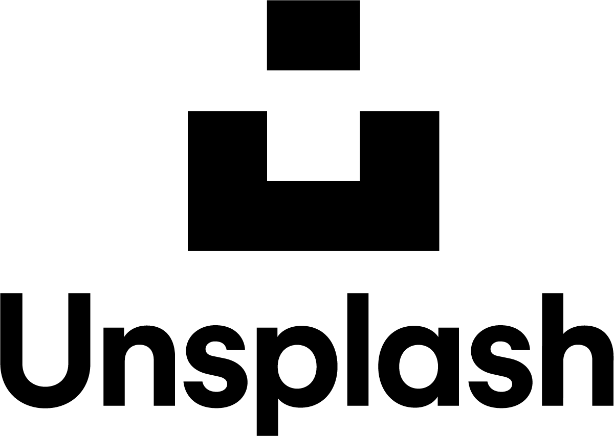

[](https://codecov.io/gh/AyushBherwani1998/unsplash_sample)

# Unsplash Sample Flutter Project

<p align= "center">
  
</p>

Welcome to the Unsplash Sample Flutter Project! This repository showcases the implementation of Flutter concepts such as Bloc pattern, Dependency Injection (DI), Code Coverage, Testing, Clean Architecture and Feature flagging using [Unleash](https://www.getunleash.io). Whether you're a Flutter enthusiast or a developer aiming to learn these practices, this project offers valuable insights.

## Table of Contents

 - [Features](#features)
 - [Getting Started](#getting-started)
   - [Prerequisites](#prerequisites)
   - [Installation](#installation)
   - [Start Unleash](#start-unleash)
   - [Enviroment](#enviroment)
 - [Project Structure](#project-structure)
 - [Dependency Injection](#dependency-injection)
 - [Testing](#testing)
 - [CodeCoverage](#code-coverage)
 - [License](#license)

## Features

- Implementation of the Bloc pattern for efficient state management.
- Utilization of GetIt for managing and injecting dependencies.
- Codecov setup to ensure thorough testing and quality assurance.
- Well-organized project structure following Clean Architecture principles.
- Utilization of Unleash to demonstrate feature flagging.

## Getting Started

Follow these steps to set up and run the project on your local machine.

### Prerequisites

 - Ensure that you have [Flutter](https://flutter.dev/docs/get-started/install) installed on your machine.
 - [Git](https://git-scm.com/)
 - [Docker](https://www.docker.com/)
 - Ensure that you have [Unplash API key](https://unsplash.com/documentation#creating-a-developer-account)
### Installation

1. Clone the repository:
   ```bash
   git clone https://github.com/AyushBherwani1998/unsplash_sample.git
   ```

2. Navigate to the project directory:
   ```bash
   cd unsplash_sample
   ```

3. Install dependencies:
   ```bash
   flutter pub get
   ```
### Start Unleash 

1. Clone the Unleash repo:
   ```bash
    git clone git@github.com:Unleash/unleash.git
    cd unleash
   ```
2. Create and attach container:
   ```bash
   docker compose up -d
   ```

The Unleash instance will be up and running on localhost:4242. The default username and password will be `admin` & `unleash4all` respectively.

### Enviroment

You need to setup envoirment while working on this sample. Create a `.env` file under `lib/core/` with the following content:
   ```
    UNSPLASH_API_KEY = hgs9ZVWrHQncX8d9tLmy-zq21412
    UNLEASH_API_KEY = *:development.xxxxyyyyzzz
   ```

## Project Structure

The project adheres to Clean Architecture principles, promoting separation of concerns and maintainability. Notable directories include:

- `lib/features/**`: Contains the primary application code.
- `lib/features/**/data/`: Manages data handling, repositories, and data sources.
- `lib/features/**/domain/`: Encompasses business logic, use cases, and entities.
- `lib/features/**/presentation/`: Handles UI components, Blocs, and Widgets.

## Dependency Injection

Dependency Injection (DI) is facilitated using the [get_it](https://pub.dev/packages/get_it) package. This fosters organized code and enhanced testability by efficiently managing dependencies.

## Testing

Unit and widget tests are included to ensure code reliability. Execute tests with the following command:

```
 flutter test
```

## Code Coverage

Code coverage is enforced using test coverage tools like [codecov](https://about.codecov.io/). This helps track tested code areas and identifies segments needing more thorough testing. You can checkout the Grid graph for the repo below:


## License
```
MIT License

Copyright (c) 2023 Ayush Bherwani

Permission is hereby granted, free of charge, to any person obtaining a copy
of this software and associated documentation files (the "Software"), to deal
in the Software without restriction, including without limitation the rights
to use, copy, modify, merge, publish, distribute, sublicense, and/or sell
copies of the Software, and to permit persons to whom the Software is
furnished to do so, subject to the following conditions:

The above copyright notice and this permission notice shall be included in all
copies or substantial portions of the Software.

THE SOFTWARE IS PROVIDED "AS IS", WITHOUT WARRANTY OF ANY KIND, EXPRESS OR
IMPLIED, INCLUDING BUT NOT LIMITED TO THE WARRANTIES OF MERCHANTABILITY,
FITNESS FOR A PARTICULAR PURPOSE AND NONINFRINGEMENT. IN NO EVENT SHALL THE
AUTHORS OR COPYRIGHT HOLDERS BE LIABLE FOR ANY CLAIM, DAMAGES OR OTHER
LIABILITY, WHETHER IN AN ACTION OF CONTRACT, TORT OR OTHERWISE, ARISING FROM,
OUT OF OR IN CONNECTION WITH THE SOFTWARE OR THE USE OR OTHER DEALINGS IN THE
SOFTWARE.
```
